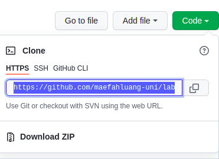
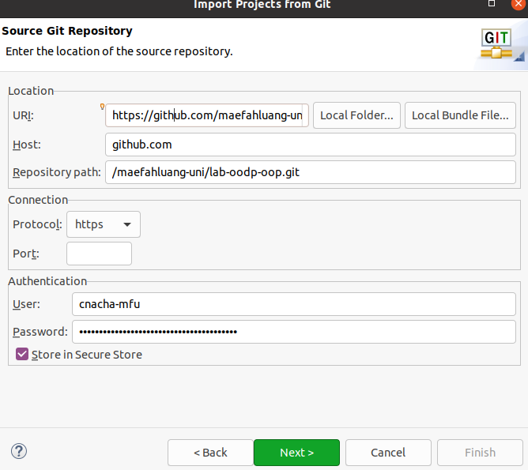
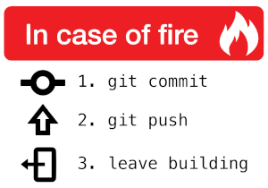

Lab - Start
==========

Before you start
----------
The purpose of this lab is to guide you through setting up the envionment for the following labs. 

## Setup Java
We will need JDK (Java Development Kit) installed on your machine. It is recommended that you use Java version 11 for this course. You may find the installation [here](https://www.oracle.com/java/technologies/javase/jdk11-archive-downloads.html). Please download the suitable installation for your machine/operating system, and follow the installation guide.

## Setup Eclipse
We will need Eclipse for this course. Eclipse is a free Java IDE (Integrated Development Editor) that allow you to code, build and test your project. Please go to [here](https://www.eclipse.org/downloads/packages/) and select *"Eclipse IDE for Enterprise Java and Web Developers"* to download. Setting up Eclipse should be straight forward. 

** You may try to search "How to install Eclipse on Windows" for example on Google. ** There are tons of tutorial out there that guide you through the installation step. After installation, please make sure you can launch the Eclipse successfully.

At launch, Eclipse will ask you for a workspace, which is where your projects will be saved. Please name it something useful such as oodp-workspace 

## Working on Project with Git
Everytime you accept a lab assignment, you will have your own repository on Github to work on it. We will mark this lab on your repository. There are basic git operations as follows.
- **Pull** is when you download your source code from the repository on Github.
- **Push** is when you upload your source code to the respository on Github.
- **Commit** is when you finish coding (and testing) and prepare the code to push to repository. This commit operation save the source code to the local repository on your machine. 

There are other git operations, more info [here](https://education.github.com/git-cheat-sheet-education.pdf). You don't need to know all of them for now.

However, all you need to know now is when you want to start working on the lab is to **pull** the project using Eclipse. After you finish making your lab, you have to **commit and push** the project using Eclipse.

## Integrate Eclipse and Git
To connect git with your Eclipse, firstly, you have to create a personal access token, which is used as a password to access your repository on Eclipse. Please follow this [guide](https://docs.github.com/en/authentication/keeping-your-account-and-data-secure/creating-a-personal-access-token). Choose all scopes and permissions. Once you receive the token, please save it somewhere (on a text file on your machine).

To pull a project from Github, on Eclipse, choose File> Import> Git> Projects from Git. The similar window should be shown as below (with all fields blank).



In URI, you have to copy URI from your Github repository by clicking on Code button and copy Clone URI as shown in the image below.


- For user, use your username on Github.
- For password, use your personal access token.

** Choose Store in Secure Store ** so that you don't have to input these credential information every time.

Click Next and choose ** Import as a general project ** and click Next/Finish all the way through. Please make sure you see a project added in the Project Explorer.

## Lab Project
In this course, we will use Maven to build, test and run our project. [Maven](https://maven.apache.org/) is a framework that support such tasks. Open the project imported from the previous step by clicking a right arrow to list folder and files in the project.

In this project, you will see pom.xml file. You don't have to modify anything in there unless we tell you so. When you open it, it specifies the library needed to build this project and the version of Java complier. 

You need to convert this project to Maven to let Eclipse recognise that it is a maven project. To do this, right click on project > Configre > Convert to Maven Project. After you do this, there will be several changes to the display of this project such as M icon is added to the project icon.

In Maven project, there are two important subfolders src/main/java is where the actual source code of the program where. src/test/java is where the unit test script is. 

Currently, there are two files, _HelloWorld_ is a program that return helllo message, and _TestHelloWorld_ is a test script that check if HelloWorld program runs properly. 

You can run unit test script to test if the program runs properly by right click on _TestHelloWorld_ and choose Run As > JUnit Test. This opens JUnit view at the bottom on Eclipse. The green check icon indicate that the test passes. If the test fails, a blue cross icon appears. 

The test should fail now because the program supposes to print outs "Hello James" but it prints out "Hi James", please follow the next step to fix this.


## Pushing project
Let's fix the program in this project and push it back to the Github. Go to HelloWorld.java and change from 'Hi' to 'Hello'. Please see TODO comment. 

:sparkles: **Hint: Thoughout every lab, you will find TODO comment all over, please pay attention to these TODO as they guide you to complete the exercise**

Rerun the test script to make sure the test passes. 

To commit and push the project, right click on project > Team > Commit. The Git Staging view appears at the bottom on the screen. 
- On the Unstaged Changes, it shows what has been changed and not yet commit to the repository. 
- Select all of them to stage (by clicking ++ icon). 
- Type in Commit message, such as "Fix hello method". Click "Commit and Push" button.
All codes should now be pushed(uploaded) to Github. You may check this by going to Github repository and check HelloWorld.java in there.




Oh one last thing!
----------------
Please introduce yourself by editing this file (README.md), put in your name/ nick name or how you want us to call you below between \`\`\` symbols (replace "Your name"). And commit and Push this project again. Please make sure your name is updated on Github as well.

```
Your name
```
:tada: Sweet! That's all for this lab. You are now ready to make a real deal in the next lab.


Oh one very last thing!
----------------
:metal: If you are around the campus, also please pick up Github materials and a cool sticker for your laptop at the office of School of IT (Floor 3 at E3 building)

